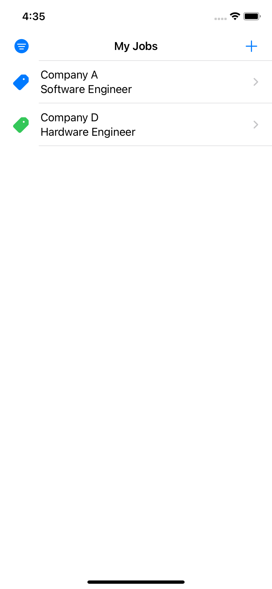
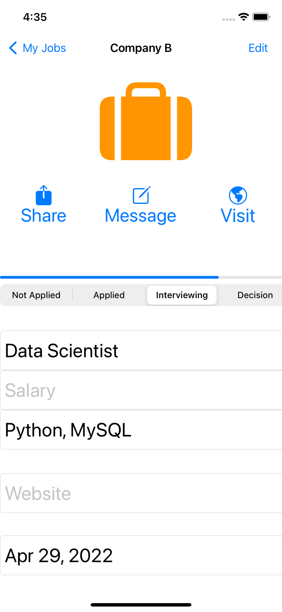
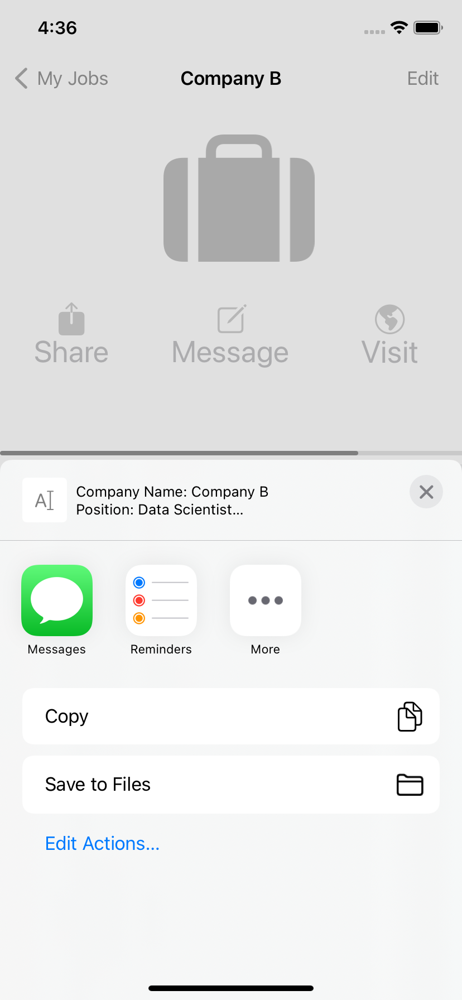

# JobMemo
Job Memo app let you quickly record desired jobs and help you track application progress. 
## About
Developed with UIKit, the app uses coredata, table, segue. 
Just add the job you want, fill out the required fields, and click save. 
After that you can choose to share the job, or write a auto message to the recruiter by using the information saved, or visit the website quickly without having to type it in every time. 
You will also be able to filter them by status of the application. So you don't have to be overwhelmed by hundreds of application sitting around. Please enjoy the app.
## Screenshots
 
 
